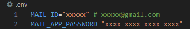

# DCC-MAIL-SENDER

### setup

#### setup .env
- Create a file and rename it to `.env` on project root folders;
- <a href='https://myaccount.google.com/apppasswords'>Create a app password</a> and add to .env as `MAIL_APP_PASSWORD="your_password"`;
- Add your email id as `MAIL_ID="your_mail_id"`;

.env shoud looks like:

